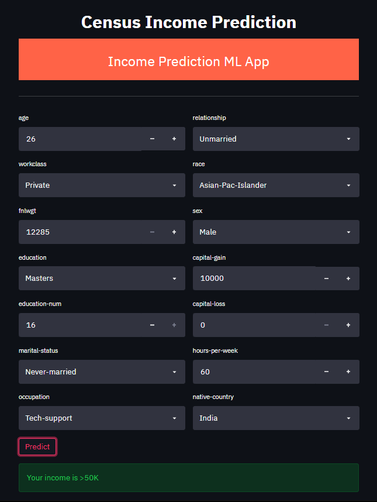

# Census Income Prediction Machine Learning Deployment

This is a repository about the basics of deploying a machine learning model:

✔️ Model training using sklearn <br>
✔️ Model API development using Flask <br>
✔️ API documentation using Swagger <br>
✔️ API testing using Postman <br>
✔️ Contanerization using Docker <br> 
✔️ A simple frontend using Streamlit <br>


## Dataset
[Census Income Data Set](https://archive.ics.uci.edu/ml/datasets/Census+Income) from the UCI machine learning repository

| feature        | values                                                                                                                                                                                                                                                                                                                                                                                                                          |
|:---------------|:--------------------------------------------------------------------------------------------------------------------------------------------------------------------------------------------------------------------------------------------------------------------------------------------------------------------------------------------------------------------------------------------------------------------------------|
| age            | continuous.                                                                                                                                                                                                                                                                                                                                                                                                                     |
| workclass      | Private, Self-emp-not-inc, Self-emp-inc, Federal-gov, Local-gov, State-gov, Without-pay, Never-worked.                                                                                                                                                                                                                                                                                                                          |
| fnlwgt         | continuous.                                                                                                                                                                                                                                                                                                                                                                                                                     |
| education      | Bachelors, Some-college, 11th, HS-grad, Prof-school, Assoc-acdm, Assoc-voc, 9th, 7th-8th, 12th, Masters, 1st-4th, 10th, Doctorate, 5th-6th, Preschool.                                                                                                                                                                                                                                                                          |
| education-num  | continuous.                                                                                                                                                                                                                                                                                                                                                                                                                     |
| marital-status | Married-civ-spouse, Divorced, Never-married, Separated, Widowed, Married-spouse-absent, Married-AF-spouse.                                                                                                                                                                                                                                                                                                                      |
| occupation     | Tech-support, Craft-repair, Other-service, Sales, Exec-managerial, Prof-specialty, Handlers-cleaners, Machine-op-inspct, Adm-clerical, Farming-fishing, Transport-moving, Priv-house-serv, Protective-serv, Armed-Forces.                                                                                                                                                                                                       |
| relationship   | Wife, Own-child, Husband, Not-in-family, Other-relative, Unmarried.                                                                                                                                                                                                                                                                                                                                                             |
| race           | White, Asian-Pac-Islander, Amer-Indian-Eskimo, Other, Black.                                                                                                                                                                                                                                                                                                                                                                    |
| sex            | Female, Male.                                                                                                                                                                                                                                                                                                                                                                                                                   |
| capital-gain   | continuous.                                                                                                                                                                                                                                                                                                                                                                                                                     |
| capital-loss   | continuous.                                                                                                                                                                                                                                                                                                                                                                                                                     |
| hours-per-week | continuous.                                                                                                                                                                                                                                                                                                                                                                                                                     |
| native-country | United-States, Cambodia, England, Puerto-Rico, Canada, Germany, Outlying-US(Guam-USVI-etc), India, Japan, Greece, South, China, Cuba, Iran, Honduras, Philippines, Italy, Poland, Jamaica, Vietnam, Mexico, Portugal, Ireland, France, Dominican-Republic, Laos, Ecuador, Taiwan, Haiti, Columbia, Hungary, Guatemala, Nicaragua, Scotland, Thailand, Yugoslavia, El-Salvador, Trinadad&Tobago, Peru, Hong, Holand-Netherlands. |

## Run `Flask` app in `Docker`


* build the image 
```bash
$ docker build -t income_pred_app .
```

* Run the container
```bash
$ docker run -p 5000:5000 income_pred_app
```

* Visit `localhost:5000/apidocs` for `Swagger API`


## Run `Streamlit` app

```bash
$ streamlit run streamlit_app.py
```




